# Kamu Keyboardの組み立て方  

本ガイドはKamu KeyboardのV1を使用して作成されています。  
基本的な組み立て手順は同一ですので、部品を置き換えて組み立てをお願いします。  

# 必要部品  
- PCB   x1  
- ProMicro  x2  
- TRRSジャック  x2  
- タクトスイッチ    x2  
- スイッチソケット（Cherry MX） x10  
- OLED（オプション）    x2  
- アクリルプレート 2mm（トップ）    x2
- アクリルプレート 2mm（ボトム）    x2
- アクリルプレート 2mm（カバー）    x2
- M2 ネジ（皿ねじ以外で3mm以上5mm以下で）   x28
- M2 スペーサー 7mm x14

# 組み立て手順  

## 01. PCBの端材部分をカットする  
PCBの表面はこちらです。  
  
PCBの裏面はこちらです。  
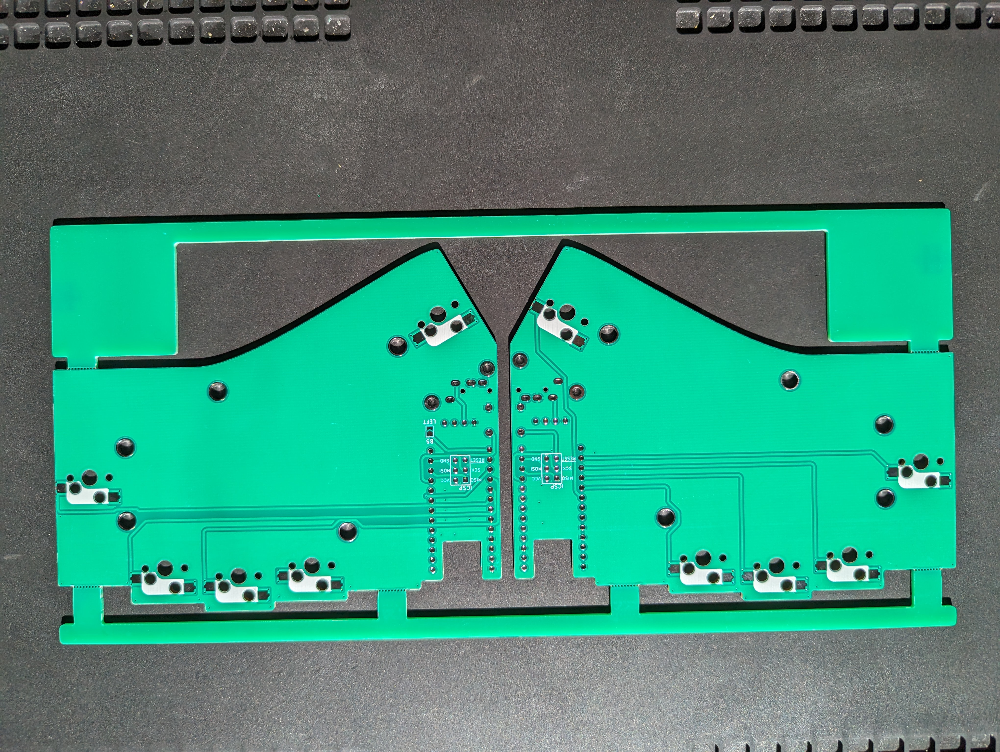  

端材部分をカットします。  
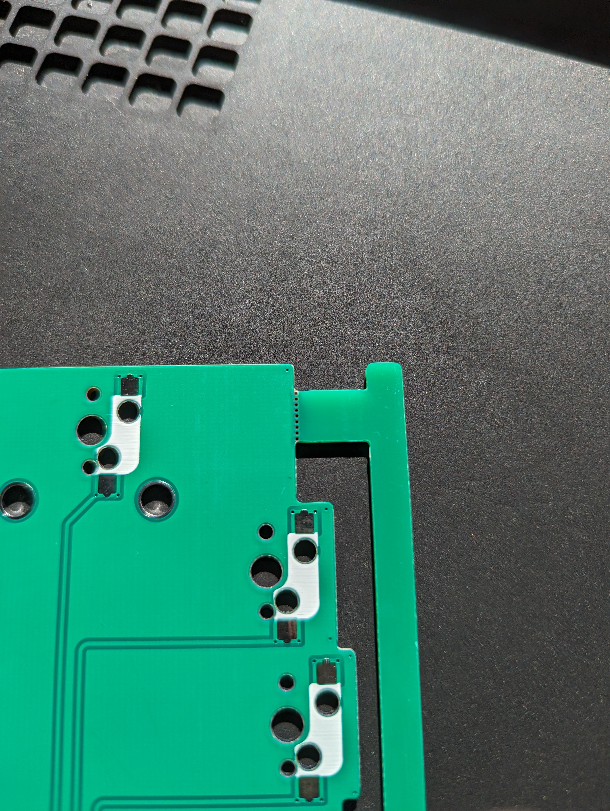  
該当箇所をヤスリ等で削ります。  
  
  

## 02. ソケットを半田付けする  
スイッチソケットのパッドに予備半田を行います。  
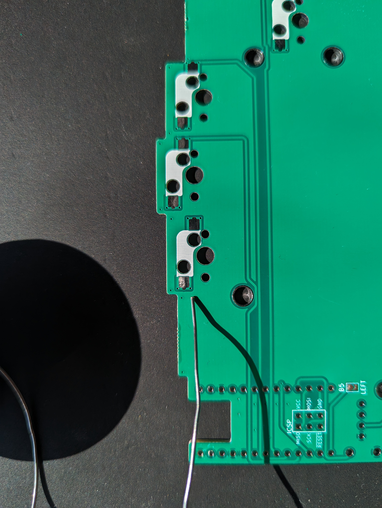  
  

ソケットはこのような形状です。  
  

残りを半田付けします。  
（画像はスイッチが取り付けられています）  
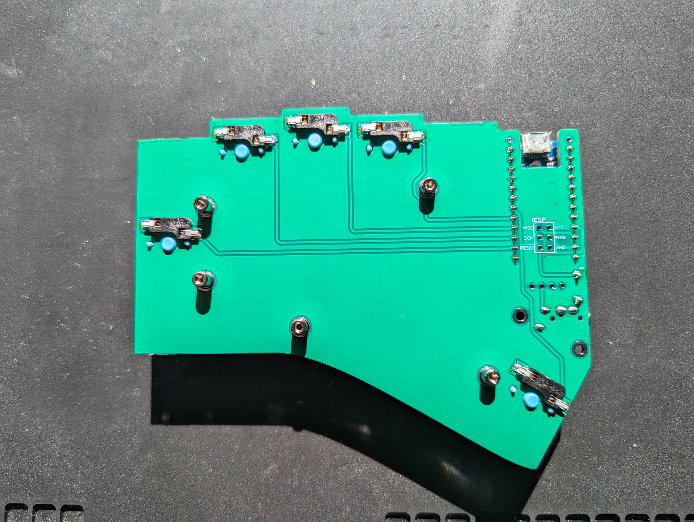  

## 03. Pro Microを半田付けする  
コンスルーを取り付けます。  
  
取り付け向きは同じにし、側面の窓は両方とも上側になるようとりつけます。  
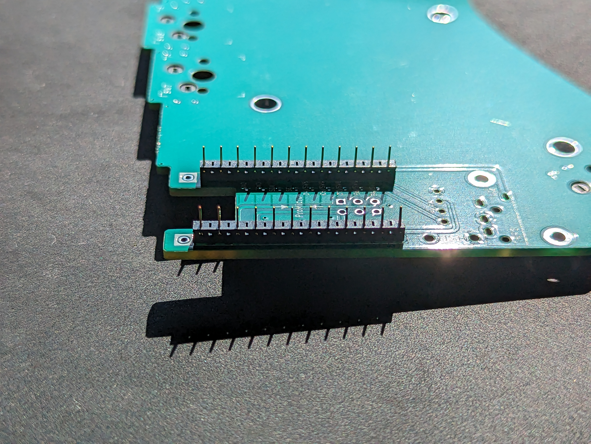  

Pro Microはこのような見た目です。  
  
これを先程のコンスルーに差し込みます。  
  
対角線上のピンを最初に固定します。  
  
四隅を固定し、残りすべてのピンを半田付けします。  
  
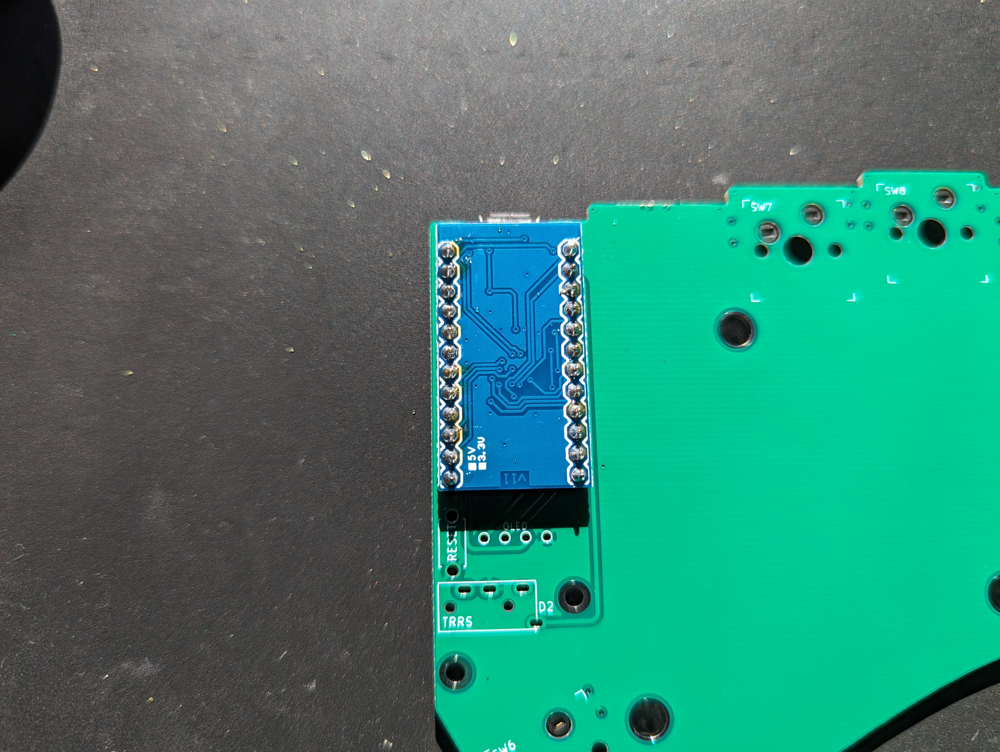  

## 04. リセットスイッチとTRRSジャックを半田付けする  
リセットスイッチはこのような見た目です。  
  
TRRSジャックはこのような見た目です。  
  

これらを基板表面に取り付けます。  
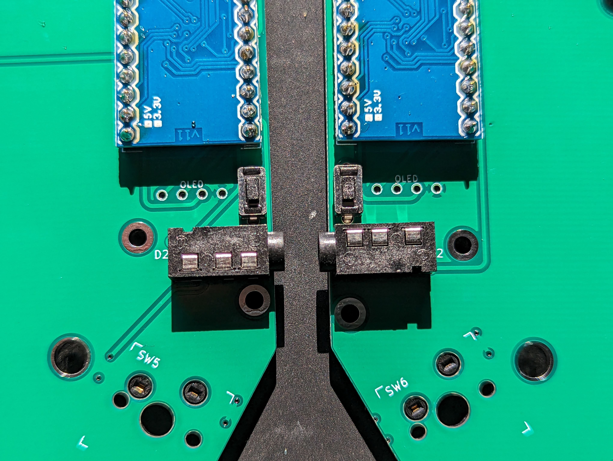  
裏面を半田付けします。  
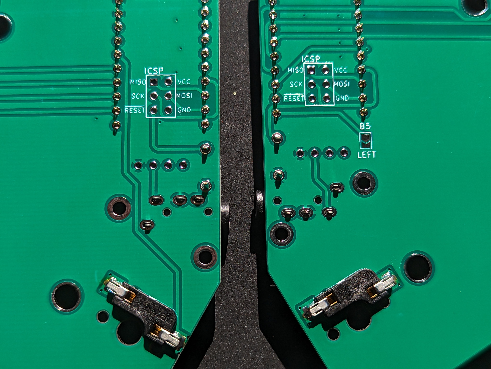  
## 05. アクリルプレートの保護シートを剥がし、スイッチを嵌める  
アクリルの保護シートを剥がします。  
  
スイッチをはめ込みます。  
  

## 06. スイッチをPCBに差し込む  
PCBにスイッチを取り付けます。  
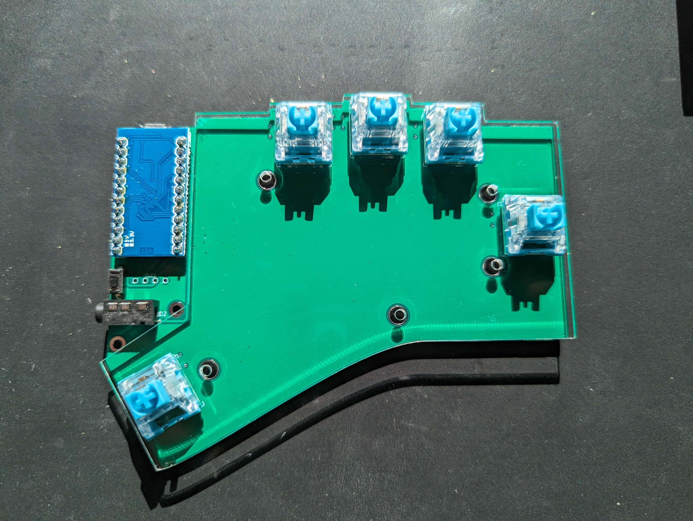  
## 07. スペーサーとネジを付け固定する  
スペーサーとネジを取り付け、固定します。  
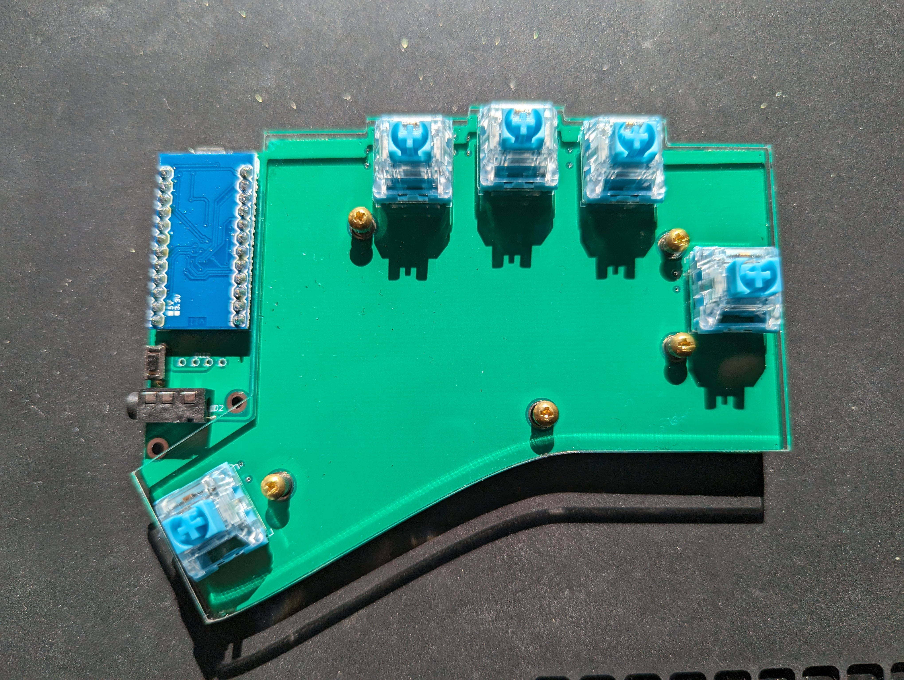  

完成！  
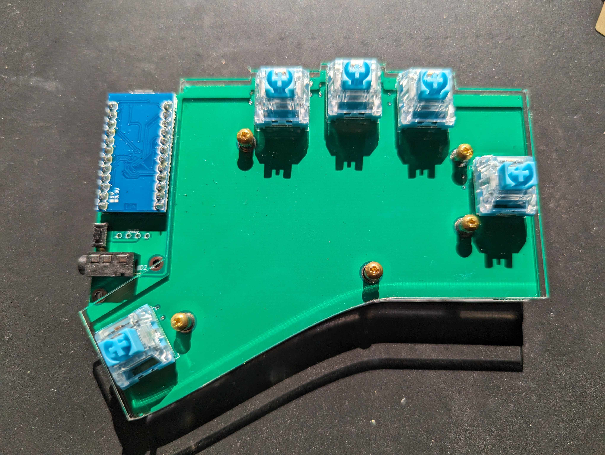  